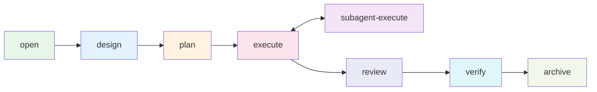

<div align="right">

[English](README.md) · [中文](README-zh.md)

</div>

<h1 align="center">flow-comet</h1>

<p align="center">
  <strong>flow-kit 9 阶段开发工作流的自动化执行引擎 —— 面向 Claude Code 平台。</strong>
  <br />
  <em>确定性状态机 · 协议驱动 · guard 校验 · 子代理隔离执行</em>
</p>

<p align="center">
  <a href="#快速开始"></a>
  <a href="LICENSE"></a>
</p>

<p align="center">
  <a href="https://claude.ai/code"></a>
  <a href="https://github.com/rihebty/flow-kit"></a>
  <a href="https://github.com/rpamis/comet"></a>
  <a href="CHANGELOG-zh.md"></a>
</p>

---

## 为什么用 flow-comet

flow-comet 把 flow-kit 的 9 阶段开发流程（CHANGE → REQUIREMENT → DESIGN → TASK → DEV → TEST → REVIEW → INTEGRATION → ARCHIVE）从"依赖人工纪律的手动流程"变成**可验证的确定性状态机**：

- **自动路由**——脚本管理阶段推进、guard 校验产物质量、hook 拦截跨阶段写入
- **协议驱动**——内置 8 节点协议是默认工作流；任意已安装 skill 可组合为自定义协议，在同一引擎上运行（见[自定义协议](docs/PROTOCOL-zh.md)）
- **三层防线**——物理写入拦截（hook）+ 协调者禁令 + exit 越俎代庖检测
- **子代理隔离执行**——实现工作委托给 fresh-context 子代理，回传可验证的 Return Contract
- **文件即真相恢复**——状态从 `.specs/` 工件推导，恢复不依赖对话历史

## 生态关系

| 项目 | 定位 | 与 flow-comet 的关系 |
|------|------|---------------------|
| [flow-kit](https://github.com/rihebty/flow-kit) | 方法论与工件体系（9 阶段流程、`.specs/` 模板、R1-R8 规则） | **依赖**——flow-comet 是它的执行自动化层；产物与规则来自 flow-kit |
| [Comet](https://github.com/rpamis/comet) | Skill Creator 生态（bundle 创作、hook guard 模式、状态机） | **机制来源**——flow-comet 大量借鉴 Comet 的机制范式（协议即事实源、脚本拥有状态、guard 门禁、hook 拦截）；**运行时可选**（复制安装无需 Comet CLI）。详见[生态](docs/ECOSYSTEM-zh.md) |
| **Comet Classic** | Comet 的经典工作流（OpenSpec + Superpowers） | **不依赖**——flow-comet 是独立 workflow-kernel；状态与 classic 不互通（自有 `.comet/flow-comet-state.json` + 文件推导路由） |

## 快速开始

需要目标项目安装 [Claude Code](https://claude.ai/code) 与 [flow-kit](https://github.com/rihebty/flow-kit)（见[安装](docs/INSTALLATION-zh.md)）。

```bash
# 1. 从本仓库安装（方案 A：prepare-env 安装器）
cd <flow-comet 仓库>
node scripts/prepare-env.mjs --target <目标项目绝对路径>
```

```bash
# 2. 在目标项目新开会话，输入：
/flow-comet
```

首次调用先确认范围，然后自动完成：创建 `change/<id>` 分支 → 初始化状态 → 进入 open 节点 → 产出 `CHANGE.md` / `REQUIREMENT.md`。之后每个阶段自动路由——你只需要回答决策点（范围确认、技术栈选型、破坏性变更、REVIEW 结论、归档确认）。

在项目首次使用时，工作流会自动检测项目上下文（`CONTEXT.md`）是否存在，缺失时提示初始化——检测到既有 AI 上下文文档（如 `CLAUDE.md` / `AGENTS.md`）会读取并整合（带出处标注），**绝不修改既有文件**。上下文已存在且新鲜的项目完全静默。无需记忆任何独立命令。

## 使用

- **[8 节点工作流](docs/USAGE-zh.md)**——逐节点职责、分支模式、执行模式、决策点
- **[自定义协议](docs/PROTOCOL-zh.md)**——通过 `/flow-comet-compose` 把任意已安装 skill 组合成自定义工作流
- **[核心机制](docs/MECHANISM-zh.md)**——状态机、三层防线、guard 校验、执行模型
- **[故障排查](docs/TROUBLESHOOTING-zh.md)**——BLOCKED/WARN 信息与处理

## 架构



引擎从 `.specs/` 工件推导状态（determineNode）进行节点间路由，由 guard exit 校验门控推进。

## 目录结构

```
flow-comet/
├── .comet/bundle-drafts/   ★ 权威源（19 skills + scripts）
├── scripts/                prepare-env 安装器
├── docs/
│   ├── examples/           工作流产物示例
│   └── ECOSYSTEM.md        flow-kit 与 Comet 的作用、借鉴边界
│   └── INSTALLATION.md     安装指南
│   └── USAGE.md            使用指南
│   └── PROTOCOL.md         自定义协议指南
│   └── MECHANISM.md        核心机制（行为层）
│   └── TROUBLESHOOTING.md  故障排查
│   └── VERSIONS.md         版本与兼容性
└── CHANGELOG.md            Keep a Changelog 风格
```

## 技术栈

| 层 | 技术 |
|----|------|
| 运行时 | Node.js ≥ 18（ESM，零第三方依赖） |
| 平台 | Claude Code（skill 体系、`.claude/` 安装、hooks） |
| 方法论 | [flow-kit](https://github.com/rihebty/flow-kit)（产物、规则、模板） |

## 文档

| 文档 | 说明 |
|------|------|
| [生态](docs/ECOSYSTEM-zh.md) | flow-kit 与 Comet 的作用、flow-comet 借鉴什么与明确不吸收什么 |
| [安装](docs/INSTALLATION-zh.md) | 前置依赖、prepare-env 方案 A/B、安装验证 |
| [使用](docs/USAGE-zh.md) | 8 节点工作流、分支模式、执行模式、决策点 |
| [自定义协议](docs/PROTOCOL-zh.md) | 组合 skill 成自定义工作流 |
| [核心机制](docs/MECHANISM-zh.md) | 状态机、防线、guard 校验 |
| [故障排查](docs/TROUBLESHOOTING-zh.md) | 常见错误与处理 |
| [版本](docs/VERSIONS-zh.md) | SemVer 策略、兼容性 |
| [产物示例](docs/examples/) | 全流程工件示例 |
| [变更日志](CHANGELOG-zh.md) | 版本历史（Keep a Changelog） |

## 贡献

完整指南见 [CONTRIBUTING-zh.md](CONTRIBUTING-zh.md)——分支模型（`feature → dev → main`）、PR 流程、合并规则与提交规范。速览：

1. 从 `dev` 开分支：`git checkout dev && git checkout -b feature/<描述>`
2. 修改 skill/脚本请改 `.comet/bundle-drafts/flow-comet/skills/`（权威源）；TDD——先写 RED 场景
3. 运行回归：`node .comet/bundle-drafts/flow-comet/skills/flow-comet/scripts/guard-self-test.mjs` → `ALL 87 SCENARIOS PASSED`
4. 开 PR 合入 `dev`（merge commit）；发布 PR `dev → main`（squash）

## License

[MIT](LICENSE) © 2026 baobaolaodie

flow-comet 依赖 [flow-kit](https://github.com/rihebty/flow-kit)（MIT）与 [Comet](https://github.com/rpamis/comet)（MIT）。
