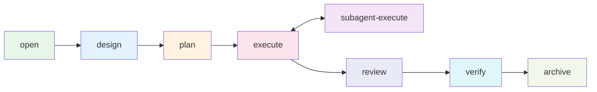

<div align="right">

[English](README.md) · [中文](README-zh.md)

</div>

<h1 align="center">flow-comet</h1>

<p align="center">
  <strong>把 AI 编码纪律变成可验证状态机的自动化执行引擎 —— 面向 flow-kit 9 阶段工作流,为 Claude Code 与 Codex 构建。</strong>
  <br />
  <em>面向 AI 编码工作流——确定性状态机 · 协议驱动 · guard 校验 · 子代理隔离执行</em>
</p>

<p align="center">
  <a href="#快速开始"></a>
  <a href="LICENSE"></a>
</p>

<p align="center">
  <a href="https://claude.ai/code"></a>
  <a href="https://github.com/openai/codex"></a>
  <a href="https://github.com/rihebty/flow-kit"></a>
  <a href="https://github.com/rpamis/comet"></a>
</p>

<p align="center">
  <a href="https://nodejs.org"></a>
  <a href="https://github.com/baobaolaodie/flow-comet/actions"></a>
  <a href="CHANGELOG-zh.md"></a>
</p>

---

## 为什么用 flow-comet

如果你用过 [superpowers](https://github.com/obra/superpowers)、[OpenSpec](https://github.com/Fission-AI/OpenSpec)、[GSD](https://github.com/open-gsd/gsd-core) 这类技能式纪律，痛点很熟悉：纪律靠模型自觉，进度活在对话历史里。flow-comet 把 flow-kit 的 9 阶段开发流程（CHANGE → REQUIREMENT → DESIGN → TASK → DEV → TEST → REVIEW → INTEGRATION → ARCHIVE）从"依赖人工纪律的手动流程"变成**可验证的确定性状态机**：

- **自动路由**——脚本管理阶段推进、guard 校验产物质量、hook 拦截跨阶段写入
- **协议驱动**——内置 8 节点协议是默认工作流；任意已安装 skill 可组合为自定义协议，在同一引擎上运行（见[自定义协议](docs/PROTOCOL-zh.md)）
- **三层防线**——物理写入拦截（hook）+ 协调者禁令 + exit 越俎代庖检测
- **子代理隔离执行**——实现工作委托给 fresh-context 子代理，回传可验证的 Return Contract
- **文件即真相恢复**——状态从 `.specs/` 工件推导，恢复不依赖对话历史

## 快速开始

需要目标项目安装 [Claude Code](https://claude.ai/code)（或 [Codex](https://github.com/openai/codex)）与 [flow-kit](https://github.com/rihebty/flow-kit)（见[安装](docs/INSTALLATION-zh.md)）。

```bash
# 1. 从本仓库安装（方案 A：prepare-env 安装器）
cd <flow-comet 仓库>
node scripts/prepare-env.mjs --target <目标项目绝对路径>
```

安装器默认面向 Claude Code（行为不变）。面向 Codex：`node scripts/prepare-env.mjs --target <路径> --platform codex`——技能安装到自动发现的 `.agents/skills/`，编排规则注入 `AGENTS.md` 托管区，写入守卫 hook 经 Codex PreToolUse 拦截 Bash 写命令（首次使用需信任 hook：`/hooks`）。平台也可在终端交互选择（TTY）；非交互环境（CI/脚本）按目标项目既有 `.claude/` / `.codex/` 自动探测，均无则默认 Claude Code。

```bash
# 2. 在目标项目新开 Claude Code 会话，输入：
/flow-comet
#    （Codex：在 Codex 会话中调用技能——`/use flow-comet` 或自然语言；
#     同一工作流，见安装指南「在 Codex 上使用 flow-comet」）
```

首次调用先确认范围，然后自动完成：创建 `change/<id>` 分支 → 初始化状态 → 进入 open 节点 → 产出 `CHANGE.md` / `REQUIREMENT.md`。之后每个阶段自动路由——你只需要回答决策点（范围确认、技术栈选型、破坏性变更、REVIEW 结论、归档确认）。

在项目首次使用时，工作流会自动检测项目上下文（`CONTEXT.md`）是否存在，缺失时提示初始化——检测到既有 AI 上下文文档（如 `CLAUDE.md` / `AGENTS.md`）会读取并整合（带出处标注），**绝不修改既有文件**。上下文已存在且新鲜的项目完全静默。无需记忆任何独立命令。

## 使用

- **[8 节点工作流](docs/USAGE-zh.md)**——逐节点职责、分支模式、执行模式、决策点
- **[自定义协议](docs/PROTOCOL-zh.md)**——通过 `/flow-comet-compose` 把任意已安装 skill 组合成自定义工作流
- **[核心机制](docs/MECHANISM-zh.md)**——状态机、三层防线、guard 校验、执行模型
- **[故障排查](docs/TROUBLESHOOTING-zh.md)**——BLOCKED/WARN 信息与处理

入口是 `/flow-comet` 命令；状态查看与推进可从命令行完成（下方路径为 Claude Code 安装形态 `.claude/skills/`；Codex 安装于 `.agents/skills/`——见[安装](docs/INSTALLATION-zh.md)）：

```bash
node .claude/skills/flow-comet/scripts/workflow-state.mjs status   # 当前 change + 节点
node .claude/skills/flow-comet/scripts/workflow-state.mjs next     # 下一节点 + 技能
```

## 架构



引擎从 `.specs/` 工件推导状态（determineNode）进行节点间路由，由 guard exit 校验门控推进。

## 什么是 flow-kit

[flow-kit](https://github.com/rihebty/flow-kit) 是一套融合了主流 AI 编码工作流——[superpowers](https://github.com/obra/superpowers)、[OpenSpec](https://github.com/Fission-AI/OpenSpec)、[spec-kit](https://github.com/github/spec-kit)、[GSD](https://github.com/open-gsd/gsd-core)、[gstack](https://github.com/garrytan/gstack)、[claude-task-master](https://github.com/eyaltoledano/claude-task-master)——再按自己的流程重排的纯 Markdown 开发方法论：9 阶段流程（CHANGE → REQUIREMENT → DESIGN → TASK → DEV → TEST → REVIEW → INTEGRATION → ARCHIVE）、`.specs/` 工件模板与 R1-R8 行为规则。没有运行时、没有 CLI——克隆进项目即可用：它定义"该产出什么、该守什么规矩"，但推进全靠人与 AI 的纪律。

## 为什么选择 flow-comet

### 横向对比

| 项目 | 定位 | 工作机制 | 与 flow-comet 的关系 |
|------|------|---------|---------------------|
| **flow-kit** | 纯 Markdown 方法论包：9 阶段流程 + `.specs/` 模板 + R1-R8 规则，零运行时 | 人按阶段加载 prompt 文件推进，状态经 `.md` 工件传递 | **依赖/底座**——flow-comet 是它的执行自动化层，工件与规则完全继承 |
| **OpenSpec**（Fission-AI） | 规范驱动开发框架：编码前加一层轻量规范 | `openspec/` 目录，每个变更一套 proposal/specs/design/tasks，propose→apply→verify→archive | **思想来源 + 轻量替代**——规范先行思想被 flow-kit 融合；独立使用时更轻（无状态机、无阶段门强制） |
| **Superpowers**（obra） | Claude Code 技能集 + 完整开发方法论 | 可组合技能（头脑风暴/计划/TDD/调试/评审），按上下文触发，靠指令约束 | **思想来源 + 部分重叠**——技能式纪律依赖模型自觉；flow-comet 把同款纪律脚本化、机器校验化 |
| **comet**（rpamis） | 可恢复长任务工作流 + 技能平台：协议状态机、guard 门、hook 拦截 | `/comet` 按配置路由；Classic = OpenSpec + Superpowers 五阶段状态机 | **机制来源**——flow-comet 吸收其机制形态（协议即事实源、脚本管状态、guard 门、hook 白名单），丢弃平台设施（eval/发布）；与 Comet Classic 状态不互通 |
| **GSD** | 规范驱动开发的元提示/上下文工程工作流 | 里程碑→切片→任务；每阶段 fresh context 预内联上下文；工作树隔离 + UAT | **思想来源（同类）**——fresh-context 执行与阶段门思想一致；无脚本状态机路由，靠提示词纪律 |
| **spec-kit**（GitHub） | SDD 工具包：Spec→Plan→Tasks→Implement | 每阶段产 markdown 工件喂给下一阶段；任务格式带顺序 ID、并行标记 [P]、文件路径 | **思想来源（同类）**——任务带文件路径/并行标记的形态与 flow-kit TASK 同源；无阶段迁移强制 |
| **claude-task-master** | AI 驱动的任务管理系统（MCP + CLI） | PRD 解析→任务分解→依赖图→next_task 编排 | **补足**——只管任务层（分解/排序/依赖），不管阶段门、工件验证与写权限 |

### 纵向对比：手动 flow-kit → flow-comet

| 维度 | 手动 flow-kit（靠纪律） | flow-comet（自动化） |
|------|------------------------|---------------------|
| 阶段推进 | 人记住流程、手动加载 prompt；跳步/漏步靠自觉 | 脚本从 `.specs/` 工件实时推导当前节点，自动路由；顺序错误直接阻断 |
| 验证 | 人对照规则自查工件；TEST.md 验证命令"应该跑" | guard 在每节点出入口强制校验工件与节段；verify 真实执行 TEST.md 命令并计数失败 |
| 纪律强制 | 规则是 markdown 文字，模型可能忽略 | 三层防御：写文件白名单物理拦截越权 / 协调者禁令 / 退出接管检测 |
| 恢复 | 依赖对话记忆，换会话易丢进度 | 文件即真相：从 `.specs/` 重新推导节点并纠偏，任何会话/断线可恢复 |
| 并行实现 | 人协调多窗口，易越界 | 子代理在独立工作树隔离实现（协调者写不了源码），返回经验证的契约（提交哈希 + 证据） |
| 决策负担 | 每阶段都有确认点，人疲于应答 | 决策分四类，人只在关键点介入：范围、技术栈、破坏性变更、评审结论、归档确认 |

### 为什么选 flow-comet

1. **把"靠自觉"变成"靠机器"**——每个阶段出入口都有脚本校验：工件齐不齐、节段填没填、验证命令跑没跑、任务有没有越界，机器逐项检查并阻断。
2. **断了线、换了会话也不丢进度**——进行到哪一步永远从 `.specs/` 工件推导，不靠对话记忆；随时重开从正确节点继续。
3. **实现与协调物理隔离，防止越权**——实现交给全新上下文的子代理在独立工作树完成，必须交回"提交哈希 + 验证证据 + 完成检查"才放行；协调者被禁止写源码，写文件白名单物理拦截越权。
4. **flow-kit 方法论的原生自动化层**——不是另起炉灶：工件格式、规则、阶段与 flow-kit 完全一致；装了 flow-kit 的项目装上 flow-comet 即升级为机器化流程，无需迁移。
5. **协议驱动、零依赖、拷贝即用**——内置 8 节点流程开箱即用；任意已装技能可组合成自定义协议跑在同一引擎；Node.js 18+、无第三方依赖、一条命令装入目标项目。

**适用场景**：flow-comet 面向 Claude Code 上耗时数小时、跨多会话的开发 change——纪律自动化的价值在长任务中体现。它不是通用 CI/CD 或项目管理工具；Codex 受支持（见[安装](docs/INSTALLATION-zh.md#平台)），其他平台（Gemini / Cursor）不保证支持。

## 真实运行产物展示

一次完整 8 节点运行的全部流程工件见 [docs/examples/processor-pipeline](docs/examples/processor-pipeline/)——真实归档的 change（端到端测试项目，2026-08-13）：CHANGE / REQUIREMENT / DESIGN / TASK / 六段 SUMMARY / 带处置标记的 REVIEW / TEST / UAT / KNOWN-ISSUES / skill-load 声明标记。

```
processor-pipeline/            （归档 change，完整产物集）
├── CHANGE.md / REQUIREMENT.md / DESIGN.md / TASK.md
├── T01~T06-SUMMARY.md          （六段 SUMMARY）
├── REVIEW.md                   （发现区带处置标记）
├── TEST.md / UAT.md            （verify 出口真实执行测试命令）
├── KNOWN-ISSUES.md
└── .skill-loads/               （11 个 skill-load 声明标记）
```

**技能稳定触发**——4 小时以上会话中工作流技能持续正确加载：


**5 小时验证运行**——5 小时 14 分会话末的全量验证与用户验收（↓399k tokens）：


## 生态关系

| 项目 | 定位 | 与 flow-comet 的关系 |
|------|------|---------------------|
| [flow-kit](https://github.com/rihebty/flow-kit) | 方法论与工件体系（9 阶段流程、`.specs/` 模板、R1-R8 规则） | **依赖**——flow-comet 是它的执行自动化层；产物与规则来自 flow-kit |
| [Comet](https://github.com/rpamis/comet) | Skill Creator 生态（bundle 创作、hook guard 模式、状态机） | **机制来源**——flow-comet 大量借鉴 Comet 的机制范式（协议即事实源、脚本拥有状态、guard 门禁、hook 拦截）；**运行时可选**（复制安装无需 Comet CLI）。详见[生态](docs/ECOSYSTEM-zh.md) |
| **Comet Classic** | Comet 的经典工作流（OpenSpec + Superpowers） | **不依赖**——flow-comet 是独立 workflow-kernel；状态与 classic 不互通（自有 `.comet/flow-comet-state.json` + 文件推导路由） |

## 目录结构

```
flow-comet/
├── .comet/bundle-drafts/   ★ 权威源（19 skills + scripts）
├── scripts/                prepare-env 安装器
├── docs/
│   ├── examples/           工作流产物示例
│   ├── ECOSYSTEM.md        flow-kit 与 Comet 的作用、借鉴边界
│   ├── INSTALLATION.md     安装指南
│   ├── USAGE.md            使用指南
│   ├── PROTOCOL.md         自定义协议指南
│   ├── MECHANISM.md        核心机制（行为层）
│   ├── TROUBLESHOOTING.md  故障排查
│   └── VERSIONS.md         版本与兼容性
└── CHANGELOG.md            Keep a Changelog 风格
```

## 技术栈

| 层 | 技术 |
|----|------|
| 运行时 | Node.js ≥ 18（ESM，零第三方依赖） |
| 平台 | Claude Code（默认——skill 体系、`.claude/` 安装、hooks）；Codex（`.agents/skills/`、AGENTS.md 托管规则、PreToolUse 写拦截） |
| 方法论 | [flow-kit](https://github.com/rihebty/flow-kit)（产物、规则、模板） |

## 文档

| 文档 | 说明 |
|------|------|
| [生态](docs/ECOSYSTEM-zh.md) | flow-kit 与 Comet 的作用、flow-comet 借鉴什么与明确不吸收什么 |
| [安装](docs/INSTALLATION-zh.md) | 前置依赖、prepare-env 方案 A/B、安装验证 |
| [使用](docs/USAGE-zh.md) | 8 节点工作流、分支模式、执行模式、决策点 |
| [自定义协议](docs/PROTOCOL-zh.md) | 组合 skill 成自定义工作流 |
| [核心机制](docs/MECHANISM-zh.md) | 状态机、防线、guard 校验 |
| [故障排查](docs/TROUBLESHOOTING-zh.md) | 常见错误与处理 |
| [版本](docs/VERSIONS-zh.md) | SemVer 策略、兼容性 |
| [产物示例](docs/examples/) | 全流程工件示例 |
| [变更日志](CHANGELOG-zh.md) | 版本历史（Keep a Changelog） |
| [安全](SECURITY-zh.md) | 如何报告漏洞 |
| [行为准则](CODE_OF_CONDUCT-zh.md) | 社区准则 |

## 贡献

完整指南见 [CONTRIBUTING-zh.md](CONTRIBUTING-zh.md)——分支模型（`feature → dev → main`）、PR 流程、合并规则与提交规范。速览：

1. 从 `dev` 开分支：`git checkout dev && git checkout -b feat/<描述>`
2. 修改 skill/脚本请改 `.comet/bundle-drafts/flow-comet/skills/`（权威源）；TDD——先写 RED 场景
3. 运行回归：`node .comet/bundle-drafts/flow-comet/skills/flow-comet/scripts/guard-self-test.mjs` → `ALL 137 SCENARIOS PASSED`
4. 开 PR 合入 `dev`（squash——change 级提交）；发布 PR `dev → main`（squash——发布级提交）

CI 在每个 PR 与 push 时自动强制仓库约定（回归、PR 纪律、版本一致性、死链）。本地 hook（提交/推送消息检测）通过 `node scripts/install-commit-hook.mjs` 安装——完整指南见 [CONTRIBUTING-zh.md](CONTRIBUTING-zh.md)。

## License

[MIT](LICENSE) © 2026 baobaolaodie

flow-comet 依赖 [flow-kit](https://github.com/rihebty/flow-kit)（MIT）与 [Comet](https://github.com/rpamis/comet)（MIT）。
