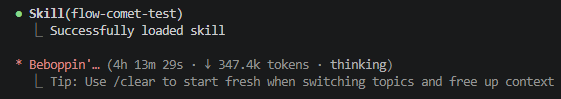
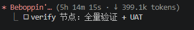

<div align="right">

[English](README.md) · [中文](README-zh.md)

</div>

<h1 align="center">flow-comet</h1>

<p align="center">
  <strong>把 AI 编码纪律变成可验证状态机的自动化执行引擎 —— 面向 flow-kit 9 阶段工作流,为 Claude Code、Codex 与 DeepSeek Harness 构建。</strong>
  <br />
  <em>面向 AI 编码工作流——确定性状态机 · 协议驱动 · guard 校验 · 子代理隔离执行</em>
</p>

<p align="center">
  <a href="#快速开始"></a>
  <a href="LICENSE"></a>
</p>

<p align="center">
  <a href="https://claude.ai/code"></a>
  <a href="https://github.com/openai/codex"></a>
  <a href="https://github.com/deepseek-ai/deepseek-harness"></a>
  <a href="https://github.com/rihebty/flow-kit"></a>
  <a href="https://github.com/rpamis/comet"></a>
</p>

<p align="center">
  <a href="https://nodejs.org"></a>
  <a href="https://github.com/baobaolaodie/flow-comet/actions"></a>
  <a href="CHANGELOG-zh.md"></a>
</p>

---


## 快速开始

在你的项目目录下执行三步：

```bash
# 1. 全局安装 CLI（Node.js 18+）
npm install -g flow-comet

# 2. 进入你的项目
cd <你的项目>

# 3. 把 flow-comet 装进这个项目
fcomet init
```

`fcomet` 与 `flow-comet` 是同一个安装器的两个命令名。只要其它参数已经表达了意图，`init` 词元可以省略（`fcomet --target <dir>` 等价）；`--target` 本身也可省略，缺省为当前目录。**不带任何参数**时只打印用法并非零退出，不会安装。交互式终端首次运行会询问装哪个平台；非交互用 `--platform claude-code`、`--platform codex`、`--platform dsh`，或用逗号组合（如 `--platform claude-code,dsh`）与 `--platform all`。重复执行同一条命令是**幂等更新**。升级全局包只换 CLI——要让项目里的副本更新，需在该项目重跑 `fcomet init`。

**验证**：

```bash
fcomet --version                                   # 已安装的 CLI 版本
cat .claude/skills/flow-comet/INSTALLED_VERSION    # 写进本项目的版本标识
```

安装器把标识写到：Claude Code 为 `.claude/skills/flow-comet/INSTALLED_VERSION`，Codex 为 `.agents/skills/...`，dsh 为 `.dsh/skills/...`。它记录这份副本的来源版本：npm 安装写**随包发布的版本**；从仓库 clone 安装写该仓库的 `git describe` 值（clone 领先 tag 时才带 `-<n>-g<hash>` 后缀）。

## 怎么用

在项目里开一个会话，调用工作流：

- **Claude Code** —— `/flow-comet`
- **Codex** —— 调用该技能（`/use flow-comet`，或直接用自然语言说要走 flow-comet 工作流）
- **DeepSeek Harness** —— 调用 `flow-comet` 技能

首次调用会先确认范围，然后自动创建该 change 的分支、初始化状态并进入第一个节点，在 `.specs/` 下产出这个 change 的 `CHANGE.md` / `REQUIREMENT.md`。此后每个阶段自动路由——你只需要回答决策点（范围、技术栈、破坏性变更、审查发现、归档确认）。项目首次使用时会检测到缺少项目上下文，并在开始前提议用你既有的文档生成一份。

想知道它走到哪儿了，直接问它就行——也可以在项目里用命令行 `status` / `next` 查看（各平台路径见[安装](docs/INSTALLATION-zh.md)）。

工件放在 `.specs/<change-id>/`；归档时整体迁到 `.specs/archive/<日期>-<change-id>/`，并在 `.specs/CHANGELOG.md` 顶部登记一行。逐节点的走查——包括工作流在底层实际执行什么、以及需要手动驱动节点时怎么做——见[使用](docs/USAGE-zh.md)。

## 选择平台

| 平台 | 技能安装到 | Hook / 桥接 | 首次使用 |
|---|---|---|---|
| Claude Code（默认） | `.claude/skills/` | `settings.local.json` → `hooks.PreToolUse` | 需信任该工作区；无头会话需预先接受该信任 |
| Codex | `.agents/skills/` | `.codex/hooks.json`，另在 `AGENTS.md` 注入托管块 | 首次需信任项目 hook（交互式）；脚本化运行传自动化开关——见[安装](docs/INSTALLATION-zh.md) |
| DeepSeek Harness（dsh） | `.dsh/skills/` | `$DSH_HOME` 下的全局桥接 loader，另在 `AGENTS.md` 注入托管块 | 无 hook 信任步骤 |

前置条件、四种安装方式、各平台的验证步骤、以及重置（purge 是删除并重建，**不是卸载**）行为：见[安装](docs/INSTALLATION-zh.md)。

## 为什么用 flow-comet

如果你用过 [superpowers](https://github.com/obra/superpowers)、[OpenSpec](https://github.com/Fission-AI/OpenSpec)、[GSD](https://github.com/open-gsd/gsd-core) 这类技能式纪律，痛点很熟悉：纪律靠模型自觉，进度活在对话历史里。flow-comet 把 flow-kit 的 9 阶段开发流程（CHANGE → REQUIREMENT → DESIGN → TASK → DEV → TEST → REVIEW → INTEGRATION → ARCHIVE）从"依赖人工纪律的手动流程"变成**可验证的确定性状态机**：

- **自动路由**——脚本管理阶段推进、guard 校验产物质量、hook 拦截跨阶段写入
- **协议驱动**——内置 8 节点协议是默认工作流；任意已安装 skill 可组合为自定义协议，在同一引擎上运行（见[自定义协议](docs/MECHANISM-zh.md#自定义协议)）
- **三层防线**——物理写入拦截（hook）+ 协调者禁令 + exit 越俎代庖检测
- **子代理隔离执行**——实现工作委托给 fresh-context 子代理，回传可验证的 Return Contract
- **文件即真相恢复**——状态从 `.specs/` 工件推导，恢复不依赖对话历史


## 为什么选择 flow-comet

### 横向对比

| 项目 | 定位 | 工作机制 | 与 flow-comet 的关系 |
|------|------|---------|---------------------|
| **flow-kit** | 纯 Markdown 方法论包：9 阶段流程 + `.specs/` 模板 + R1-R8 规则，零运行时 | 人按阶段加载 prompt 文件推进，状态经 `.md` 工件传递 | **依赖/底座**——flow-comet 是它的执行自动化层，工件与规则完全继承 |
| **OpenSpec**（Fission-AI） | 规范驱动开发框架：编码前加一层轻量规范 | `openspec/` 目录，每个变更一套 proposal/specs/design/tasks，propose→apply→verify→archive | **思想来源 + 轻量替代**——规范先行思想被 flow-kit 融合；独立使用时更轻（无状态机、无阶段门强制） |
| **Superpowers**（obra） | Claude Code 技能集 + 完整开发方法论 | 可组合技能（头脑风暴/计划/TDD/调试/评审），按上下文触发，靠指令约束 | **思想来源 + 部分重叠**——技能式纪律依赖模型自觉；flow-comet 把同款纪律脚本化、机器校验化 |
| **comet**（rpamis） | 可恢复长任务工作流 + 技能平台：协议状态机、guard 门、hook 拦截 | `/comet` 按配置路由；Classic = OpenSpec + Superpowers 五阶段状态机 | **机制来源**——flow-comet 吸收其机制形态（协议即事实源、脚本管状态、guard 门、hook 白名单），丢弃平台设施（eval/发布）；与 Comet Classic 状态不互通 |
| **GSD** | 规范驱动开发的元提示/上下文工程工作流 | 里程碑→切片→任务；每阶段 fresh context 预内联上下文；工作树隔离 + UAT | **思想来源（同类）**——fresh-context 执行与阶段门思想一致；无脚本状态机路由，靠提示词纪律 |
| **spec-kit**（GitHub） | SDD 工具包：Spec→Plan→Tasks→Implement | 每阶段产 markdown 工件喂给下一阶段；任务格式带顺序 ID、并行标记 [P]、文件路径 | **思想来源（同类）**——任务带文件路径/并行标记的形态与 flow-kit TASK 同源；无阶段迁移强制 |
| **claude-task-master** | AI 驱动的任务管理系统（MCP + CLI） | PRD 解析→任务分解→依赖图→next_task 编排 | **补足**——只管任务层（分解/排序/依赖），不管阶段门、工件验证与写权限 |

### 纵向对比：手动 flow-kit → flow-comet

| 维度 | 手动 flow-kit（靠纪律） | flow-comet（自动化） |
|------|------------------------|---------------------|
| 阶段推进 | 人记住流程、手动加载 prompt；跳步/漏步靠自觉 | 脚本从 `.specs/` 工件实时推导当前节点，自动路由；顺序错误直接阻断 |
| 验证 | 人对照规则自查工件；TEST.md 验证命令"应该跑" | guard 在每节点出入口强制校验工件与节段；verify 真实执行 TEST.md 命令并计数失败 |
| 纪律强制 | 规则是 markdown 文字，模型可能忽略 | 三层防御：写文件白名单物理拦截越权 / 协调者禁令 / 退出接管检测 |
| 恢复 | 依赖对话记忆，换会话易丢进度 | 文件即真相：从 `.specs/` 重新推导节点并纠偏，任何会话/断线可恢复 |
| 并行实现 | 人协调多窗口，易越界 | 子代理在独立工作树隔离实现（协调者写不了源码），返回经验证的契约（提交哈希 + 证据） |
| 决策负担 | 每阶段都有确认点，人疲于应答 | 决策分类（用户决策/自动处理/停止条件/手动交接），人只在关键点介入：范围、技术栈、破坏性变更、评审结论、归档确认 |

### 为什么选 flow-comet

1. **把"靠自觉"变成"靠机器"**——每个阶段出入口都有脚本校验：工件齐不齐、节段填没填、验证命令跑没跑、任务有没有越界，机器逐项检查并阻断。
2. **断了线、换了会话也不丢进度**——进行到哪一步永远从 `.specs/` 工件推导，不靠对话记忆；随时重开从正确节点继续。
3. **实现与协调物理隔离，防止越权**——实现交给全新上下文的子代理在独立工作树完成，必须交回"提交哈希 + 验证证据 + 完成检查"才放行；协调者被禁止写源码，写文件白名单物理拦截越权。
4. **flow-kit 方法论的原生自动化层**——不是另起炉灶：工件格式、规则、阶段与 flow-kit 完全一致；装了 flow-kit 的项目装上 flow-comet 即升级为机器化流程，无需迁移。
5. **协议驱动、最小依赖、安装即用**——内置 8 节点流程开箱即用；任意已装技能可组合成自定义协议跑在同一引擎；Node.js 18+；第三方依赖仅 `@clack/prompts`，且仅安装器 TTY 多选使用（其余场景自动回退 readline）；一条命令装入目标项目。

**适用场景**：flow-comet 面向 Claude Code 上耗时数小时、跨多会话的开发 change——纪律自动化的价值在长任务中体现。它不是通用 CI/CD 或项目管理工具；Codex 与 DeepSeek Harness 受支持（见[安装](docs/INSTALLATION-zh.md#平台)），其他平台（Gemini / Cursor）不保证支持。

## 真实运行产物展示

一次完整 8 节点运行的全部流程工件见 [docs/examples/processor-pipeline](docs/examples/processor-pipeline/)——真实归档的 change（端到端测试项目，2026-08-13）：CHANGE / REQUIREMENT / DESIGN / TASK / 六段 SUMMARY / 带处置标记的 REVIEW / TEST / UAT / KNOWN-ISSUES / skill-load 声明标记。

```
processor-pipeline/            （归档 change，完整产物集）
├── CHANGE.md / REQUIREMENT.md / DESIGN.md / TASK.md
├── T01~T06-SUMMARY.md          （六段 SUMMARY）
├── REVIEW.md                   （发现区带处置标记）
├── TEST.md / UAT.md            （verify 出口真实执行测试命令）
├── KNOWN-ISSUES.md
└── .skill-loads/               （11 个 skill-load 声明标记）
```

**技能稳定触发**——4 小时以上会话中工作流技能持续正确加载：



**5 小时验证运行**——5 小时 14 分会话末的全量验证与用户验收（↓399k tokens）：




## 与上游项目的关系

flow-comet 自动化的是 [flow-kit](https://github.com/rihebty/flow-kit) 的方法学——阶段、工件、规则与模板都是继承而非重造。两个项目**不共享文件**：flow-kit 以只读、锁定的依赖形式被消费，本仓库保留一份 vendored 副本仅作格式基准。可以借用什么、分歧如何声明，写在[贡献指南](CONTRIBUTING-zh.md)的「借用边界」一节。

## 文档

| 文档 | 它是下列内容的唯一权威处 |
|---|---|
| [安装](docs/INSTALLATION-zh.md) | 前置条件、四种安装方式、平台选择、安装验证、以及重置（purge 是删除并重建，非卸载） |
| [使用](docs/USAGE-zh.md) | 8 节点工作流、节点生命周期与其命令、工件、分支模式、执行模式、用户入口 |
| [核心机制](docs/MECHANISM-zh.md) | 行为契约、三条防线、守卫校验、自定义协议 |
| [故障排查](docs/TROUBLESHOOTING-zh.md) | 按症状分节：安装、首次运行、节点卡住、平台 |
| [版本](docs/VERSIONS-zh.md) | 版本语义、九处版本面、发布清单 |
| [变更日志](CHANGELOG-zh.md) | 逐版本历史 |
| [贡献指南](CONTRIBUTING-zh.md) | 贡献流程与借用边界 |
| [安全](SECURITY.md) | 漏洞上报方式 |

## 贡献

完整指南见 [CONTRIBUTING-zh.md](CONTRIBUTING-zh.md)——分支模型（`feature → dev → main`）、PR 流程、合并规则与提交规范。速览：

1. 从 `dev` 开分支：`git checkout dev && git checkout -b feat/<描述>`
2. 修改 skill/脚本请改 `.flow-comet/skills/`（权威源）；TDD——先写 RED 场景
3. 运行回归：`node .flow-comet/skills/flow-comet/scripts/guard-self-test.mjs` → `ALL 292 SCENARIOS PASSED`
4. 开 PR 合入 `dev`（squash——change 级提交）；发布 PR `dev → main`（merge——change 级提交进入 main，每次发布后 dev 不再领先）

CI 在每个 PR 与 push 时自动强制仓库约定（回归、PR 纪律、版本一致性、死链）。本地 hook（提交/推送消息检测）通过 `node scripts/install-commit-hook.mjs` 安装——完整指南见 [CONTRIBUTING-zh.md](CONTRIBUTING-zh.md)。

## License

[MIT](LICENSE) © 2026 baobaolaodie

flow-comet 依赖 [flow-kit](https://github.com/rihebty/flow-kit)（MIT）与 [Comet](https://github.com/rpamis/comet)（MIT）。
