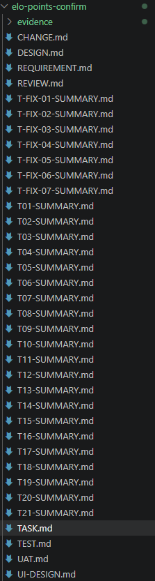
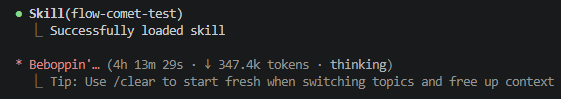
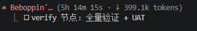
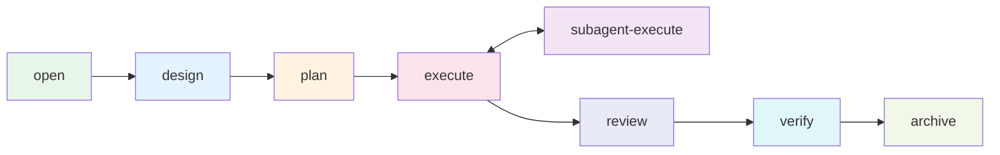

<div align="right">

[English](README.md) · [中文](README-zh.md)

</div>

<h1 align="center">flow-comet</h1>

<p align="center">
  <strong>An automated execution engine for the flow-kit 9-stage development workflow, built for Claude Code.</strong>
  <br />
  <em>Deterministic state machine · Protocol-driven · Guard-validated · Subagent-isolated</em>
</p>

<p align="center">
  <a href="#quick-start"></a>
  <a href="LICENSE"></a>
</p>

<p align="center">
  <a href="https://claude.ai/code"></a>
  <a href="https://github.com/rihebty/flow-kit"></a>
  <a href="https://github.com/rpamis/comet"></a>
  <a href="CHANGELOG.md"></a>
</p>

---

## Why

flow-comet turns the flow-kit 9-stage process (CHANGE → REQUIREMENT → DESIGN → TASK → DEV → TEST → REVIEW → INTEGRATION → ARCHIVE) from a discipline-dependent manual flow into a **verifiable deterministic state machine**:

- **Automated routing** — scripts manage stage transitions, guard validations, and hook-based write interception
- **Protocol-driven** — the built-in 8-node protocol is the default workflow; custom protocols composed from any installed skill run on the same engine (see [Custom Protocols](docs/PROTOCOL.md))
- **Three defense layers** — physical write interception (hook), coordinator prohibition, and exit takeover detection
- **Subagent-isolated execution** — implementation work is delegated to fresh-context subagents with a verifiable Return Contract
- **File-as-truth recovery** — state is derived from `.specs/` artifacts, so recovery never depends on conversation history

## What is flow-kit

[flow-kit](https://github.com/rihebty/flow-kit) is a pure-Markdown development methodology that fuses mainstream AI coding workflows — [superpowers](https://github.com/obra/superpowers), [OpenSpec](https://github.com/Fission-AI/OpenSpec), [spec-kit](https://github.com/github/spec-kit), GSD, [gstack](https://github.com/garrytan/gstack), [claude-task-master](https://github.com/eyaltoledano/claude-task-master) — into its own 9-stage process (CHANGE → REQUIREMENT → DESIGN → TASK → DEV → TEST → REVIEW → INTEGRATION → ARCHIVE) with `.specs/` artifact templates and R1-R8 behavior rules. No runtime, no CLI — clone it into a project and it defines *what to produce and what rules to follow*, but progress relies on human (and AI) discipline.

## Why flow-comet

### Horizontal comparison

| Project | Positioning | Mechanism | Relationship to flow-comet |
|---------|-------------|-----------|---------------------------|
| **flow-kit** | Pure-Markdown methodology pack: 9-stage process + `.specs/` templates + R1-R8 rules, zero runtime | Humans load prompt files stage by stage; state flows through `.md` artifacts | **Dependency / base** — flow-comet is its automation layer; artifacts and rules fully inherited |
| **OpenSpec** (Fission-AI) | Spec-driven development framework: a lightweight spec layer before coding | `openspec/` directory, one proposal/specs/design/tasks per change, propose→apply→verify→archive | **Idea source + lighter alternative** — spec-first thinking fused into flow-kit; standalone use is lighter (no state machine, no stage gates) |
| **Superpowers** (obra) | Claude Code skill set + full dev methodology | Composable skills (brainstorm/plan/TDD/debug/review), triggered by context, enforced by instructions | **Idea source + partial overlap** — skill-based discipline relies on model compliance; flow-comet scripts and machine-verifies the same discipline |
| **comet** (rpamis) | Resumable long-task workflows + skill platform: protocol state machine, guard gates, hook interception | `/comet` routes by config; Classic = OpenSpec + Superpowers 5-stage state machine | **Mechanism source** — flow-comet borrows its mechanism shapes (protocol-as-truth, script-owned state, guard gates, hook whitelist) and drops its platform facilities (eval/publish); state does not interoperate with Comet Classic |
| **GSD** | Spec-driven development meta-prompt / context-engineering workflow | Milestones → slices → tasks; fresh context per stage with pre-inlined context; worktree isolation + UAT | **Idea source (same lane)** — fresh-context execution and stage gates align; no script state-machine routing, relies on prompt discipline |
| **spec-kit** (GitHub) | SDD toolkit: Spec → Plan → Tasks → Implement | Each stage feeds markdown artifacts to the next; task format with order IDs, parallel `[P]` markers, file paths | **Idea source (same lane)** — task-with-file-paths/parallel-marker shape is same-origin with flow-kit TASK; no stage-transition enforcement |
| **claude-task-master** | AI-driven task management (MCP + CLI) | PRD parsing → task decomposition → dependency graph → next-task orchestration | **Complement** — manages the task layer only (decomposition/ordering/dependencies), not stage gates, artifact validation, or write permissions |

### Vertical comparison: manual flow-kit → flow-comet

| Dimension | Manual flow-kit (discipline) | flow-comet (automated) |
|-----------|------------------------------|------------------------|
| Stage routing | Humans remember the flow and load prompts manually; skipping stages is on you | Scripts derive the current node from `.specs/` artifacts and route automatically; order violations are blocked |
| Validation | Humans eyeball artifacts against the rules; TEST.md commands "should" run | Guards enforce required artifacts/sections at every node entry/exit; verify actually executes the TEST.md commands and counts failures |
| Discipline enforcement | Rules are markdown text the model may ignore | Three defense layers: write whitelist physically blocks out-of-scope writes / coordinator prohibition / exit takeover detection |
| Recovery | Depends on conversation memory; progress is lost across sessions | File-as-truth: re-derive the node from `.specs/` and auto-correct state; any session resumes correctly |
| Parallel implementation | Humans coordinate multiple windows, easy to overstep | Subagents implement in isolated worktrees (coordinators cannot write source) and must return a verified contract (commit hash + evidence) |
| Decision burden | A confirmation point at every stage, humans answer everything | Decisions classified into four kinds; humans only intervene at key points (scope, tech stack, breaking changes, review findings, archive) |

### Why pick flow-comet

1. **Discipline goes from "self-discipline" to "machine-checked"** — every stage entry/exit has script validation: artifacts complete, sections filled, verify commands actually run, tasks stay in bounds.
2. **No lost progress across sessions** — where you are is always derived from `.specs/` artifacts, never from conversation memory; reopen and continue from the right node.
3. **Implementation and coordination are physically separated** — implementation runs in fresh-context subagents inside isolated worktrees and must return a verified contract; the coordinator is banned from writing source, and the write whitelist blocks violations at the physical layer.
4. **The native automation layer for flow-kit** — not a re-invention: artifact formats, rules, and stages are identical to flow-kit; a flow-kit project upgrades to a machine-driven flow by installing flow-comet, no migration needed.
5. **Protocol-driven, zero dependencies, copy-and-run** — the built-in 8-node flow works out of the box; any installed skill can be composed into a custom protocol on the same engine; Node.js 18+, no third-party dependencies, one command installs it.

## Screenshots

Real-run captures from production-length sessions. During these multi-hour runs, the **only human interaction was the workflow-defined decision points** (scope confirmation, tech-stack selection, review findings, archive confirmation) — no other manual interference or ad-hoc decisions; the specification was strictly enforced from start to finish.

**Complete artifact trail** — every workflow artifact from a real run (CHANGE / DESIGN / REQUIREMENT / REVIEW / TASK / TEST / UAT + 21 task summaries):



**Stable skill triggering** — workflow skills keep loading correctly through a 4h+ session:



**5-hour verification run** — full validation and UAT at the end of a 5h14m session (↓399k tokens):



## Ecosystem

| Project | Role | Relationship to flow-comet |
|---------|------|---------------------------|
| [flow-kit](https://github.com/rihebty/flow-kit) | Methodology & artifact system (9-stage flow, `.specs/` templates, R1-R8 rules) | **Dependency** — flow-comet is its automation layer; artifacts and rules come from flow-kit |
| [Comet](https://github.com/rpamis/comet) | Skill Creator ecosystem (bundle authoring, hook-guard pattern, state machine) | **Mechanism source** — flow-comet borrows Comet's mechanism patterns extensively (workflow-protocol as source of truth, script-owned state, guard gates, hook interception); **runtime optional** (copy install needs no Comet CLI). Details in [Ecosystem](docs/ECOSYSTEM.md) |
| **Comet Classic** | Comet's classic workflow (OpenSpec + Superpowers) | **Not a dependency** — flow-comet is an independent workflow-kernel; state does not interoperate with classic (own `.comet/flow-comet-state.json` + file-derived routing) |

## Quick Start

Requires [Claude Code](https://claude.ai/code) and [flow-kit](https://github.com/rihebty/flow-kit) in the target project (see [Installation](docs/INSTALLATION.md)).

```bash
# 1. Install from this repository (option A: prepare-env installer)
cd <flow-comet repo>
node scripts/prepare-env.mjs --target <absolute path to your project>
```

```bash
# 2. Open your project in a new Claude Code session and run:
/flow-comet
```

The first call confirms scope, then automatically creates the `change/<id>` branch, initializes state, enters the open node, and produces `CHANGE.md` / `REQUIREMENT.md`. Every subsequent stage is routed automatically — you only answer decision points (scope, tech stack, destructive changes, review findings, archive confirmation).

On first use in a project, the workflow automatically detects whether a project context (`CONTEXT.md`) exists and prompts to initialize it when missing — existing AI-context documents (such as `CLAUDE.md` / `AGENTS.md`) are read and integrated with source attribution, and existing files are never modified. Projects with a fresh context run silently. No separate command to remember.

## Usage

- **[8-node workflow](docs/USAGE.md)** — node-by-node responsibilities, branch mode, execution modes, decision points
- **[Custom protocols](docs/PROTOCOL.md)** — compose any installed skill into a custom workflow via `/flow-comet-compose`
- **[Core mechanisms](docs/MECHANISM.md)** — state machine, three defense layers, guard validation, execution model
- **[Troubleshooting](docs/TROUBLESHOOTING.md)** — BLOCKED/WARN messages and their fixes

## Architecture



The engine routes between nodes by deriving state from `.specs/` artifacts (determineNode), gated by guard exit validations.

## Directory Structure

```
flow-comet/
├── .comet/bundle-drafts/   ★ authoritative source (19 skills + scripts)
├── scripts/                prepare-env installer
├── docs/
│   ├── examples/           workflow artifact examples
│   └── ECOSYSTEM.md        roles of flow-kit & Comet, borrowing boundaries
│   └── INSTALLATION.md     installation guide
│   └── USAGE.md            usage guide
│   └── PROTOCOL.md         custom protocol guide
│   └── MECHANISM.md        core mechanisms (behavior layer)
│   └── TROUBLESHOOTING.md  failure diagnosis
│   └── VERSIONS.md         versioning & compatibility
└── CHANGELOG.md            Keep a Changelog style
```

## Tech Stack

| Layer | Technology |
|-------|------------|
| Runtime | Node.js ≥ 18 (ESM, zero third-party dependencies) |
| Platform | Claude Code (skills, `.claude/` installation, hooks) |
| Methodology | [flow-kit](https://github.com/rihebty/flow-kit) (artifacts, rules, templates) |

## Documentation

| Document | Description |
|----------|-------------|
| [Ecosystem](docs/ECOSYSTEM.md) | Roles of flow-kit & Comet, what flow-comet borrows and deliberately does not |
| [Installation](docs/INSTALLATION.md) | Prerequisites, prepare-env options A/B, installation verification |
| [Usage](docs/USAGE.md) | 8-node workflow, branch mode, execution modes, decision points |
| [Custom Protocols](docs/PROTOCOL.md) | Compose skills into custom workflows |
| [Core Mechanisms](docs/MECHANISM.md) | State machine, defense layers, guard validation |
| [Troubleshooting](docs/TROUBLESHOOTING.md) | Common errors and fixes |
| [Versions](docs/VERSIONS.md) | SemVer policy, compatibility |
| [Examples](docs/examples/) | Full workflow artifact examples |
| [Changelog](CHANGELOG.md) | Version history (Keep a Changelog) |

## Contributing

Full guide in [CONTRIBUTING.md](CONTRIBUTING.md) — branch model (`feature → dev → main`), PR workflow, merge rules, and commit convention. In short:

1. Branch from `dev`: `git checkout dev && git checkout -b feature/<description>`
2. Edit skills/scripts under `.comet/bundle-drafts/flow-comet/skills/` (authoritative source); TDD with RED scenario first
3. Run regression: `node .comet/bundle-drafts/flow-comet/skills/flow-comet/scripts/guard-self-test.mjs` → `ALL 105 SCENARIOS PASSED`
4. Open a PR into `dev` (merge commit); release PR `dev → main` (squash)

CI enforces the repository conventions automatically on every PR and push (regression, PR discipline, version consistency, dead links) — no local setup needed. See [CONTRIBUTING.md](CONTRIBUTING.md) for the full guide.

## License

[MIT](LICENSE) © 2026 baobaolaodie

flow-comet depends on [flow-kit](https://github.com/rihebty/flow-kit) (MIT) and [Comet](https://github.com/rpamis/comet) (MIT).
