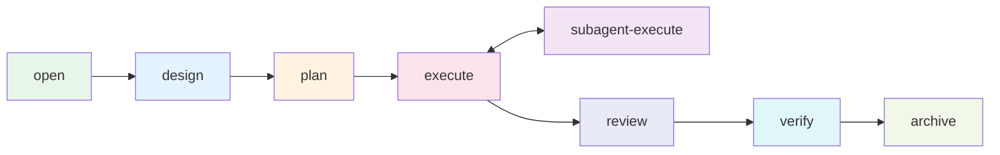

<div align="right">

[English](README.md) · [中文](README-zh.md)

</div>

<h1 align="center">flow-comet</h1>

<p align="center">
  <strong>An automated execution engine for the flow-kit 9-stage development workflow, built for Claude Code.</strong>
  <br />
  <em>Deterministic state machine · Protocol-driven · Guard-validated · Subagent-isolated</em>
</p>

<p align="center">
  <a href="#quick-start"></a>
  <a href="LICENSE"></a>
</p>

<p align="center">
  <a href="https://claude.ai/code"></a>
  <a href="https://github.com/rihebty/flow-kit"></a>
  <a href="https://github.com/rpamis/comet"></a>
  <a href="CHANGELOG.md"></a>
</p>

---

## Why

flow-comet turns the flow-kit 9-stage process (CHANGE → REQUIREMENT → DESIGN → TASK → DEV → TEST → REVIEW → INTEGRATION → ARCHIVE) from a discipline-dependent manual flow into a **verifiable deterministic state machine**:

- **Automated routing** — scripts manage stage transitions, guard validations, and hook-based write interception
- **Protocol-driven** — the built-in 8-node protocol is the default workflow; custom protocols composed from any installed skill run on the same engine (see [Custom Protocols](docs/PROTOCOL.md))
- **Three defense layers** — physical write interception (hook), coordinator prohibition, and exit takeover detection
- **Subagent-isolated execution** — implementation work is delegated to fresh-context subagents with a verifiable Return Contract
- **File-as-truth recovery** — state is derived from `.specs/` artifacts, so recovery never depends on conversation history

## Ecosystem

| Project | Role | Relationship to flow-comet |
|---------|------|---------------------------|
| [flow-kit](https://github.com/rihebty/flow-kit) | Methodology & artifact system (9-stage flow, `.specs/` templates, R1-R8 rules) | **Dependency** — flow-comet is its automation layer; artifacts and rules come from flow-kit |
| [Comet](https://github.com/rpamis/comet) | Skill Creator ecosystem (bundle authoring, hook-guard pattern, state machine) | **Mechanism source** — flow-comet borrows Comet's mechanism patterns extensively (workflow-protocol as source of truth, script-owned state, guard gates, hook interception); **runtime optional** (copy install needs no Comet CLI). Details in [Ecosystem](docs/ECOSYSTEM.md) |
| **Comet Classic** | Comet's classic workflow (OpenSpec + Superpowers) | **Not a dependency** — flow-comet is an independent workflow-kernel; state does not interoperate with classic (own `.comet/flow-comet-state.json` + file-derived routing) |

## Quick Start

Requires [Claude Code](https://claude.ai/code) and [flow-kit](https://github.com/rihebty/flow-kit) in the target project (see [Installation](docs/INSTALLATION.md)).

```bash
# 1. Install from this repository (option A: prepare-env installer)
cd <flow-comet repo>
node scripts/prepare-env.mjs --target <absolute path to your project>
```

```bash
# 2. Open your project in a new Claude Code session and run:
/flow-comet
```

The first call confirms scope, then automatically creates the `change/<id>` branch, initializes state, enters the open node, and produces `CHANGE.md` / `REQUIREMENT.md`. Every subsequent stage is routed automatically — you only answer decision points (scope, tech stack, destructive changes, review findings, archive confirmation).

On first use in a project, the workflow automatically detects whether a project context (`CONTEXT.md`) exists and prompts to initialize it when missing — existing AI-context documents (such as `CLAUDE.md` / `AGENTS.md`) are read and integrated with source attribution, and existing files are never modified. Projects with a fresh context run silently. No separate command to remember.

## Usage

- **[8-node workflow](docs/USAGE.md)** — node-by-node responsibilities, branch mode, execution modes, decision points
- **[Custom protocols](docs/PROTOCOL.md)** — compose any installed skill into a custom workflow via `/flow-comet-compose`
- **[Core mechanisms](docs/MECHANISM.md)** — state machine, three defense layers, guard validation, execution model
- **[Troubleshooting](docs/TROUBLESHOOTING.md)** — BLOCKED/WARN messages and their fixes

## Architecture



The engine routes between nodes by deriving state from `.specs/` artifacts (determineNode), gated by guard exit validations.

## Directory Structure

```
flow-comet/
├── .comet/bundle-drafts/   ★ authoritative source (19 skills + scripts)
├── scripts/                prepare-env installer
├── docs/
│   ├── examples/           workflow artifact examples
│   └── ECOSYSTEM.md        roles of flow-kit & Comet, borrowing boundaries
│   └── INSTALLATION.md     installation guide
│   └── USAGE.md            usage guide
│   └── PROTOCOL.md         custom protocol guide
│   └── MECHANISM.md        core mechanisms (behavior layer)
│   └── TROUBLESHOOTING.md  failure diagnosis
│   └── VERSIONS.md         versioning & compatibility
└── CHANGELOG.md            Keep a Changelog style
```

## Tech Stack

| Layer | Technology |
|-------|------------|
| Runtime | Node.js ≥ 18 (ESM, zero third-party dependencies) |
| Platform | Claude Code (skills, `.claude/` installation, hooks) |
| Methodology | [flow-kit](https://github.com/rihebty/flow-kit) (artifacts, rules, templates) |

## Documentation

| Document | Description |
|----------|-------------|
| [Ecosystem](docs/ECOSYSTEM.md) | Roles of flow-kit & Comet, what flow-comet borrows and deliberately does not |
| [Installation](docs/INSTALLATION.md) | Prerequisites, prepare-env options A/B, installation verification |
| [Usage](docs/USAGE.md) | 8-node workflow, branch mode, execution modes, decision points |
| [Custom Protocols](docs/PROTOCOL.md) | Compose skills into custom workflows |
| [Core Mechanisms](docs/MECHANISM.md) | State machine, defense layers, guard validation |
| [Troubleshooting](docs/TROUBLESHOOTING.md) | Common errors and fixes |
| [Versions](docs/VERSIONS.md) | SemVer policy, compatibility |
| [Examples](docs/examples/) | Full workflow artifact examples |
| [Changelog](CHANGELOG.md) | Version history (Keep a Changelog) |

## Contributing

Full guide in [CONTRIBUTING.md](CONTRIBUTING.md) — branch model (`feature → dev → main`), PR workflow, merge rules, and commit convention. In short:

1. Branch from `dev`: `git checkout dev && git checkout -b feature/<description>`
2. Edit skills/scripts under `.comet/bundle-drafts/flow-comet/skills/` (authoritative source); TDD with RED scenario first
3. Run regression: `node .comet/bundle-drafts/flow-comet/skills/flow-comet/scripts/guard-self-test.mjs` → `ALL 97 SCENARIOS PASSED`
4. Open a PR into `dev` (merge commit); release PR `dev → main` (squash)

## License

[MIT](LICENSE) © 2026 baobaolaodie

flow-comet depends on [flow-kit](https://github.com/rihebty/flow-kit) (MIT) and [Comet](https://github.com/rpamis/comet) (MIT).
