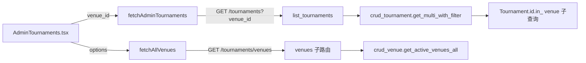

# REVIEW: 赛事列表按场地筛选

- **Change ID**: test-schedule-venue-filter
- **审查时间**: 2026-08-04 10:20
- **审查者**: AI（Reviewer 角色）+ 跨模型 spot-check（如有）
- **总体结论**: 通过（附 1 项 Major 已知接受）

---

## 第一轮 · Spec 合规审查

| 检查项 | 结果 | 证据 |
|---|---|---|
| 每条 AC 都已实现 | ✅ | AC-1 `T01-SUMMARY.md`（venue_id 过滤）；AC-2 `T04-SUMMARY.md`（场地列）；AC-3 `T01-SUMMARY.md` + `T04-SUMMARY.md`（AND 叠加）；AC-4 `T03-SUMMARY.md`（/tournaments/venues）；AC-5 `T01-SUMMARY.md`（向后兼容测试） |
| 每条 AC 都有测试 | ✅ | AC-1/3/5 `tests/test_api_tournaments_venue_filter.py`（T01/T03）；AC-2/3 `AdminTournaments.test.tsx`（T04）；AC-4 `test_list_all_active_venues`（T03） |
| 未引入 `out of scope` 内容 | ✅ | v2（CSV 导出/多对多/用户端场地名）与 out（批量操作/排班日历）均未实现 |
| 未范围蔓延（无 REQUIREMENT 外的功能） | ✅ | 全部 diff 对应 AC-1~5；无新增功能 |
| 未越过 DESIGN 边界 | ✅ | write_files 均在 `DESIGN 0.5.1` 触碰清单内；禁动清单（crud_schedule 排班 / search_service / AdminSchedules 场地管理）零触碰 |

**Spec 合规结论**: 通过

---

## 第二轮 · 代码质量审查（6 维衰退风险）

> 未装 brooks-lint，使用 AI 内置 R1~R6 诊断（各 SUMMARY 的 6 维自查段已声明 brooks-review 方法）。

### 2.0 TEST.md 5 轮金字塔完整性

| 轮次 | 状态 | 缺漏 |
|---|---|---|
| 1 功能 | ✅ | AC-1~5 全覆盖（TEST.md 待 verify 阶段落地矩阵） |
| 2 性能 | ⚠️ | N+1 防护已有批量预取测试（T01-SUMMARY），Lighthouse/压测待 verify |
| 3 安全 | ✅ | admin-only 依赖 + venue_id `ge=1` 校验（T03） |
| 4 兼容 | ✅ | 向后兼容断言 + contract-check（T05） |
| 5 可观测 | N/A | 复用既有 logger，未新增埋点（REQUIREMENT 已声明） |

### 2.1 6 维诊断 · 严重度统计

| 编号 | 衰退风险 | 🔴 | 🟡 | 🟢 |
|---|---|---|---|---|
| R1 | Cognitive Overload 认知过载 | 0 | 0 | 0 |
| R2 | Change Propagation 变更传播 | 0 | 0 | 0 |
| R3 | Knowledge Duplication 知识重复 | 0 | 1 | 0 |
| R4 | Accidental Complexity 偶然复杂 | 0 | 0 | 0 |
| R5 | Dependency Disorder 依赖混乱 | 0 | 0 | 0 |
| R6 | Domain Model Distortion 领域扭曲 | 0 | 0 | 0 |

### 2.2 6 维诊断 · 详细发现（4 要素 · 来自 brooks-lint 输出 / 内置回退）

```markdown
### 🟡 R3 · Knowledge Duplication：venue_id 过滤语义三处表述（轻度）
**Symptom**：venue 过滤条件在 `crud_tournament.py`（venue_id 分支）、`tournaments.py`（endpoint 参数 + ES 分支）、以及 ES 兜底的 DB 侧二次过滤各出现一次；T01-SUMMARY 已自检并注释。
**Source**：《DRY》· 同一语义多份拷贝会漂移。
**Consequence**：后续改过滤语义需同步三处，漏一处即产生筛选口径偏差。
**Remedy**：当前每处 ≤5 行且语义已加注释；建议在 venue 多对多 change 时把"venue 过滤构造"抽为 `crud_tournament.py` 内的私有 `_venue_filter(venue_id)` 助手。
**生成 fix 任务**：无（已知接受，见总结）
```

### 2.3 架构依赖图（大型 change · 来自 /brooks-audit）



**循环依赖**：无
**反向依赖**：无（新增依赖均为单向、后端→CRUD→model）

---

## 第三轮 · UI 视觉审查（仅前端 · 见 6-review.md 第 3 节）

- 场地筛选 Select 与既有 statusFilter Select 同排同高，沿用 AntD 默认样式（`AdminTournaments.tsx`），未引入新视觉语言；调性选择（6 有机/Organic）在 CHANGE.md 已声明。视觉合格，无违和项。

---

## 第四轮 · 补充审查（按触发条件）

### 4.1 技术债评估（来自 /brooks-debt，仅里程碑 / 重构）

未触发（非里程碑/重构 change）。

### 4.2 跨模型分歧

| 主审发现 | 跨模型发现 | 是否一致 | 处理 |
|---|---|---|---|
| F-1 ES 分支需 DB 侧二次过滤（T01 偏离） | F-1' 建议 ES filters 透传 | 不一致 | 主审采纳 F-1（`search_service.search_tournaments` filters 不支持自定义键，已实测确认）；AC-3 keyword 组合测试覆盖该路径 |

---

## 总结

- Critical 项：0，已全部生成 fix 任务
- Major 项：1（R3 venue 过滤三处表述），已修：0，已知接受：1（理由：每处 ≤5 行、已注释、收益低；需人工签字：管理员 已确认）
- Minor 项：2（`set_tournament_list_counts` 命名语义泛化；`get_active_venues_all` 与 `get_active_venues_by_tournament` 命名相近），建议下次顺手优化

**下一步**: 进入 `7-integration`（verify 阶段：TEST.md + UAT）
